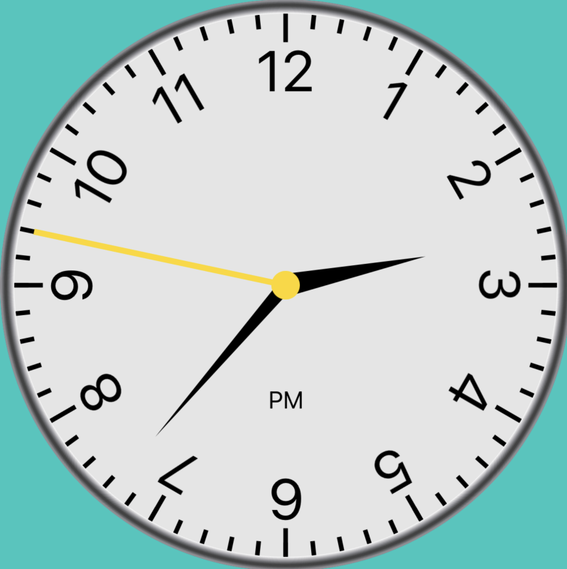
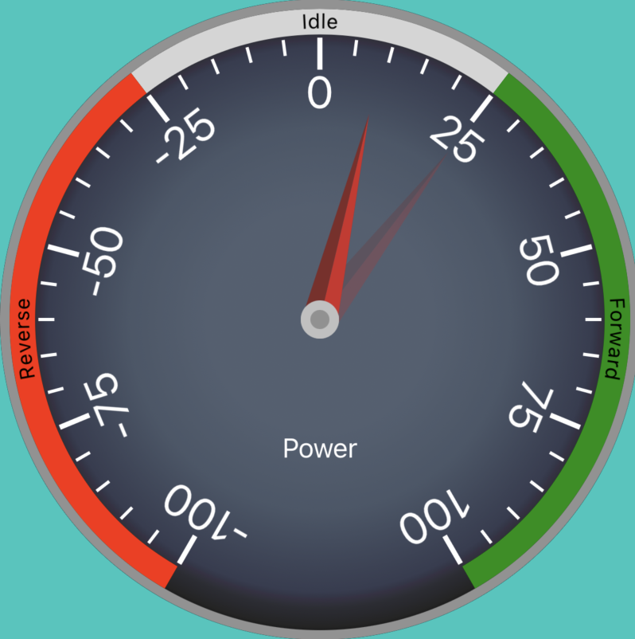
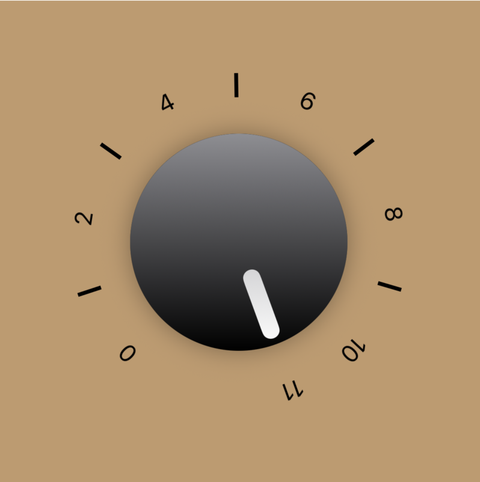

# SbjGauge

Customizable analog multi-indicator SwiftUI gauge.

Inspired by: https://github.com/Will-tm/WMGaugeView

## Design Goals

I struggle with the oversimplified symbolic UI in most applications; done in the name of minimalism. Many gauges are a a single color arc with maybe an arrow. That is not enough information for a glanceable read.

My goal is to create a library that makes it easy to design a detailed multi-value gauge with the level of skeuomorphism that fits your application's visual language.

This library has continued to evolve as my knowledge of SwiftUI increases and SwiftUI's capabilties evolve. Every rendering strategy and value is being bubbled to the public interface; with reasonable defaults.

The gauges render well on iPhone, iPad, Watch, and AppleTV. I have not thought about the 3D space of AppleVision.

## Simple Instantiation

To create a basic uncustomized gauge:

`standard(.init(value: 1.5))`

The CompositionView's constructor exposes all the component view builders for customization. I have created other built-in schemes of the gauge: Clock, Power, and Up to 11.

## TODOS
- Make Model a set of protocols, 'label' becomes an associated type
- Cleanup Tick model and views
- Correct transition animations to have entire gauge animate together
- Use swiftplayground as example
- use coordinateSpace() to eliminate the geom parameter
- Swiftui-ify ScrubView
