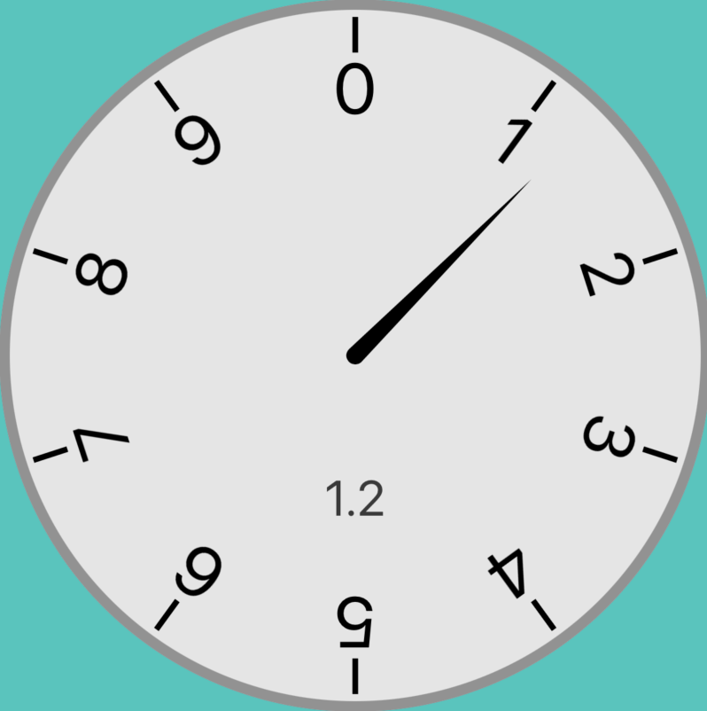

# SbjGauge

Analog multi-indicator SwiftUI gauge construction set.

Inspired by: https://github.com/Will-tm/WMGaugeView

## Design Goals

I struggle with the oversimplified symbolic UI in most applications; done in the name of minimalism. Many gauges are a a single color arc with maybe an arrow. That is not enough information for a glanceable read. We have to learn a symbol langauge, often per application. Is the arced arrow a refresh action, progress indicator, or rotate action? And what is the actual value it is suggesting?

My goal is to create a library that makes it easy to construct a detailed multi-value gauge with the level of skeuomorphism that fits your application's visual language.

This library is continuing to evolve as my knowledge of SwiftUI increases and SwiftUI's capabilties evolve. Every rendering strategy and value is being bubbled to the public interface; using SwuiftUI view compositions.

The gauges have no intrinsic size. On the highest level, a gauge is a Centered-Origin ZStack Square GeometryReader. Every gauge component should specify its dimensions using normalized values.

The gauges render well on iPhone, iPad, Watch, and AppleTV. I have not thought about the 3D space of AppleVision.

## Simple Instantiation

To create a basic uncustomized gauge:

`SbjGauge.Standard.StandardView(.init(standard: 1.5))`

I have created several built-in views of the gauge. See the included playgrounds for usage; including a build-your-own template.

## BUGS
- Correct transition animations to have entire gauge animate together.
- Fix RadialRotateModifier warning
- Solve the Closed versus Open versus Cyclic Math model and rotate problem
