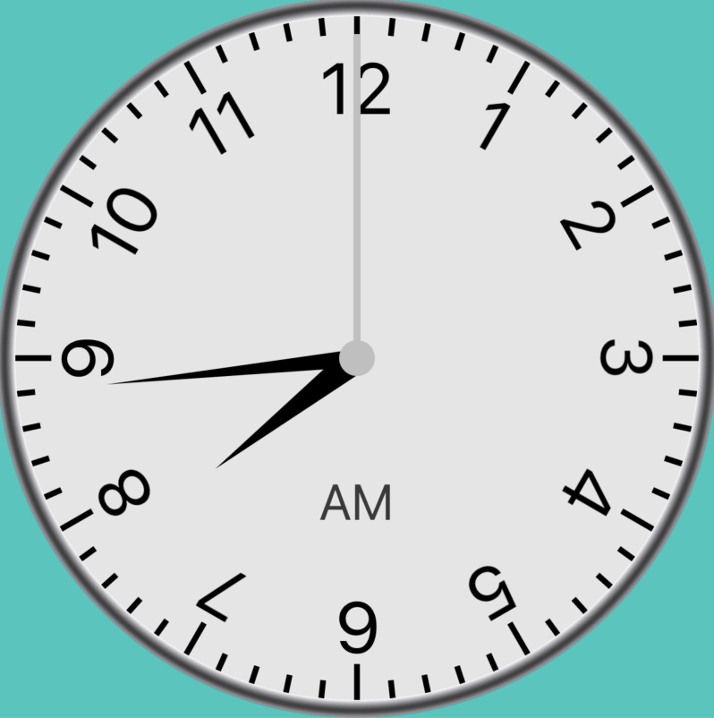
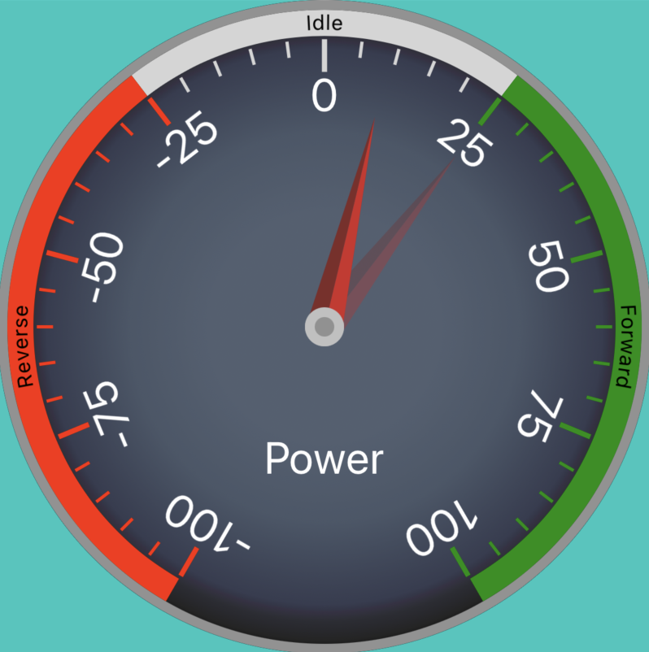
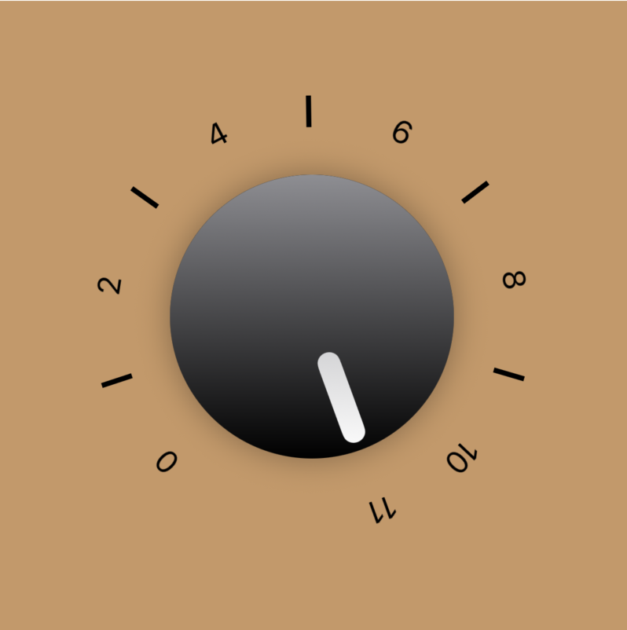
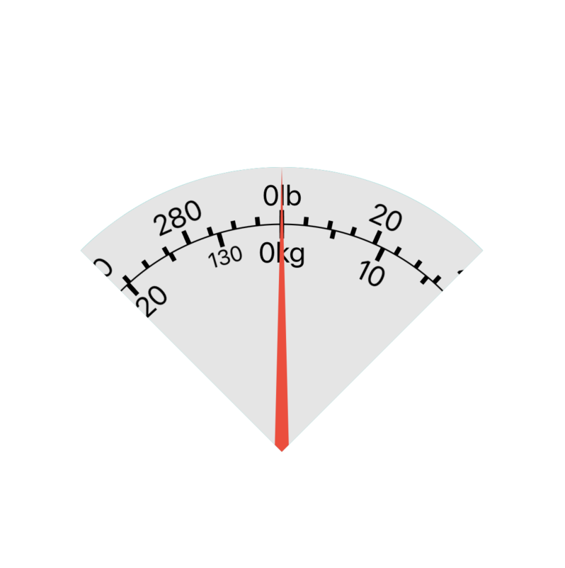

# SbjGauge

Customizable analog multi-indicator SwiftUI gauge.

Inspired by: https://github.com/Will-tm/WMGaugeView

## Design Goals

I struggle with the oversimplified symbolic UI in most applications; done in the name of minimalism. Many gauges are a a single color arc with maybe an arrow. That is not enough information for a glanceable read. We have to learn the symbol langauge, often per application; refresh action, progress indicator, or rotate action?

My goal is to create a library that makes it easy to design a detailed multi-value gauge with the level of skeuomorphism that fits your application's visual language.

This library has continued to evolve as my knowledge of SwiftUI increases and SwiftUI's capabilties evolve. Every rendering strategy and value is being bubbled to the public interface; with reasonable defaults.

The Gauge has no intrinsic size. On the highest level, it is a Centered origin ZStack GeometryReader. Every component should specify its dimensions using normalized values.

The gauges render well on iPhone, iPad, Watch, and AppleTV. I have not thought about the 3D space of AppleVision.

## Simple Instantiation

To create a basic uncustomized gauge:

`SbjGauge.Standard.StandardView(.init(standard: 1.5))`

I have created other built-in views of the gauge: Clock, Power, Scale, and UpTo11.

See the included playgrounds for examples.

## TODOS
- Make Model a set of protocols; 'label' and 'idx' become an associated types.
- Cleanup Tick model and views
- Correct transition animations to have entire gauge animate together
- Fix NeedleSetView warnings
- Swiftui-ify ScrubView
